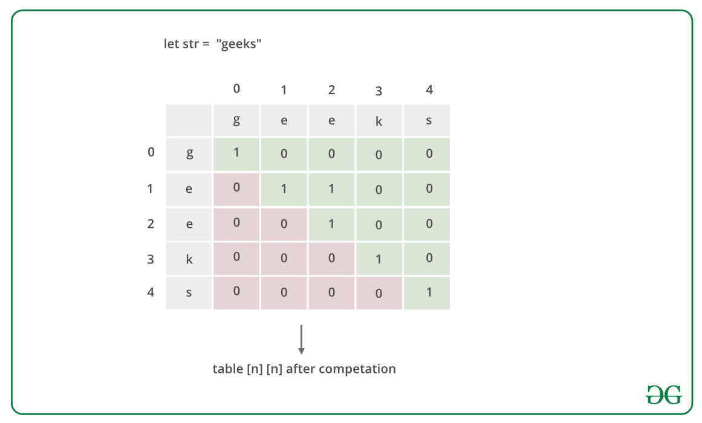
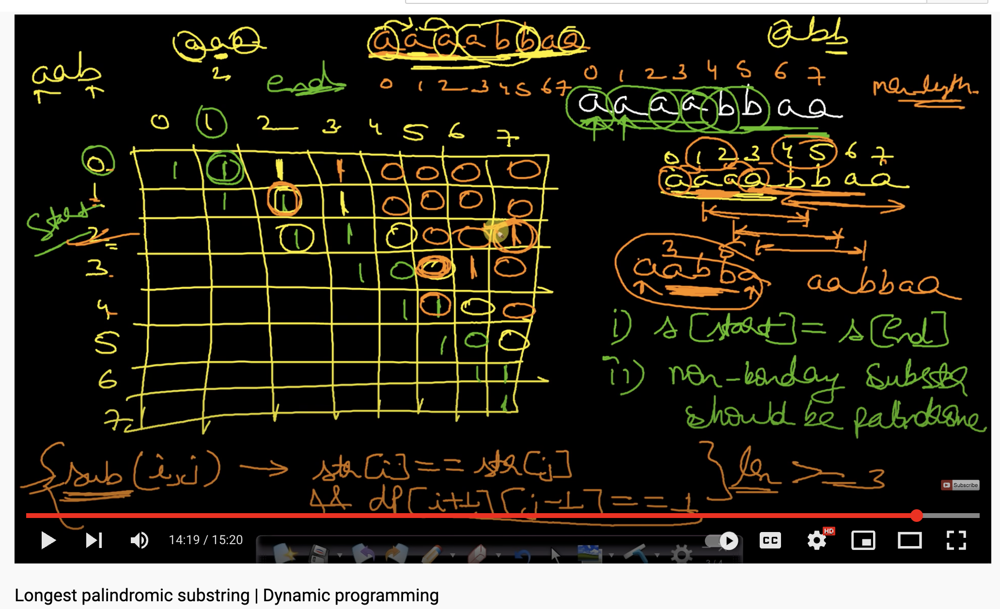

// https://www.geeksforgeeks.org/longest-palindrome-substring-set-1/

Input: Given string :"forgeeksskeegfor", 
Output: "geeksskeeg"

Input: Given string :"Geeks", 
Output: "ee"

Basically there are 2 methods 
1. Method 1: Brute Force.
    Approach: The simple approach is to check each substring whether the substring is a palindrome or not. To do this first, run three nested loops, the outer two loops pick all substrings one by one by fixing the corner characters, the inner loop checks whether the picked substring is palindrome or not.

    Time complexity: O(n^3).
    Three nested loops are needed to find the longest palindromic substring in this approach, so the time complexity is O(n^3).
    Auxiliary complexity: O(1).
    As no extra space is needed.
2. Method 2: Dynamic Programming.
    Approach: The time complexity can be reduced by storing results of sub-problems. 

    ### Maintain a boolean table[n][n] that is filled in bottom up manner.
    The value of table[i][j] is true, if the substring is palindrome, otherwise false.
    To calculate table[i][j], check the value of table[i+1][j-1], if the value is true and str[i] is same as str[j], then we make table[i][j] true.
    Otherwise, the value of table[i][j] is made false.

    Complexity Analysis:

    Time complexity: O(n^2).
    Two nested traversals are needed.
    Auxiliary Space: O(n^2).
    Matrix of size n*n is needed to store the dp array.

    //********** https://www.youtube.com/watch?v=UflHuQj6MVA ************//
    

    
     
    

    

    
     
    

        aa = palingdrome S[i] == S[i+1]

        a   a   b   a   a
        |   |
        i   j  index

         a = palingdrome (i=j=same)
        i,j
        a a = palingdrome S[i] == S[i+1]
        i i+1
        a   b   a = palingdrome (S[i] == S[j] && DP[i+1][j-1] = {b which is a palingdrome} )
        i       j   
    1. if S[i] == S[i+1] both index value are same then true (Digonal of DP Table) for length 1 string 
        means S[i] , S[i+1] i=j=o then fill true because single element itself palimdrome 
        for(i=0;i<n;i++){
            DP[i][i] = true
        }
    2. if S[i] == S[j] then true for length 2  like a , a true for i =0 j =1 
        i=1 j =2 a , b then false 
        for(i=0;i<n;i++){
            (S[i] == S[i+1] ){
                DP[i][i+1] = true
                maxLength = 2;
            }
        }
    3. if string length more than 2 , if S[i] == S[j] then true for length 2  like a , a true for i =0 j =1 
        i=1 j =2 a , b then false 
        for(i=0;i<n;i++){
            for(j=1;i<n;i++){
                (S[i] == S[j] && DP[i+1][j-1]){
                    DP[j][j] = true
                 }
                }
            }
        }

