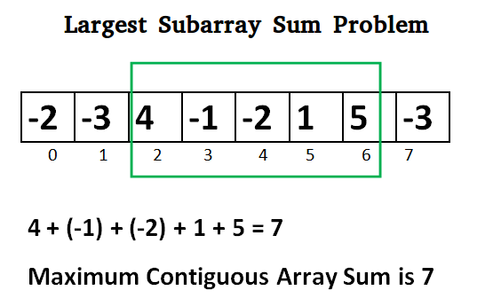

https://www.geeksforgeeks.org/largest-sum-contiguous-subarray/?ref=leftbar-rightbar


# Kadane’s Algorithm O(n):

<p align="center">

</br>
</p>

```
Initialize:
    max_so_far = INT_MIN
    max_ending_here = 0

Loop for each element of the array
  (a) max_ending_here = max_ending_here + a[i]
  (b) if(max_so_far < max_ending_here)
            max_so_far = max_ending_here
  (c) if(max_ending_here < 0)
            max_ending_here = 0
return max_so_far
```
## Explanation: 
The simple idea of Kadane’s algorithm is to look for all positive contiguous segments of the array (max_ending_here is used for this). And keep track of the maximum sum contiguous segment among all positive segments (max_so_far is used for this). Each time we get a positive-sum compare it with max_so_far and update max_so_far if it is greater than max_so_far 

```

    Lets take the example:
    {-2, -3, 4, -1, -2, 1, 5, -3}

    max_so_far = INT_MIN
    max_ending_here = 0

    for i=0,  a[0] =  -2
    max_ending_here = max_ending_here + (-2)
    Set max_ending_here = 0 because max_ending_here < 0
    and set max_so_far = -2

    for i=1,  a[1] =  -3
    max_ending_here = max_ending_here + (-3)
    Since max_ending_here = -3 and max_so_far = -2, max_so_far will remain -2
    Set max_ending_here = 0 because max_ending_here < 0
      
    
    for i=2,  a[2] =  4
    max_ending_here = max_ending_here + (4)
    max_ending_here = 4
    max_so_far is updated to 4 because max_ending_here greater 
    than max_so_far which was -2 till now

    for i=3,  a[3] =  -1
    max_ending_here = max_ending_here + (-1)
    max_ending_here = 3

    for i=4,  a[4] =  -2
    max_ending_here = max_ending_here + (-2)
    max_ending_here = 1

    for i=5,  a[5] =  1
    max_ending_here = max_ending_here + (1)
    max_ending_here = 2

    for i=6,  a[6] =  5
    max_ending_here = max_ending_here + (5)
    max_ending_here = 7
    max_so_far is updated to 7 because max_ending_here is 
    greater than max_so_far

    for i=7,  a[7] =  -3
    max_ending_here = max_ending_here + (-3)
    max_ending_here = 4
    
```
    

##### Note: The above algorithm only works if and only if at least one positive number should be present otherwise it does not work i.e if an Array contains all negative numbers it doesn’t work.


* https://www.youtube.com/watch?v=MSkk49c0U04

# Step 1 printCurrent if latest sum is smaller than previous :- 
<p align="center">

</br>
</p>

# Step 2 PrintLatestMaxSum if latest sum is greater than previous :- 
<p align="center">

</br>
</p>

# Step 3 without Dynamic Programming:- 
<p align="center">

</br>
</p>

# Step 4 With Dynamic Programming:- 
<p align="center">

</br>
</p>

# Step 5 Code:- 
<p align="center">

</br>
</p>