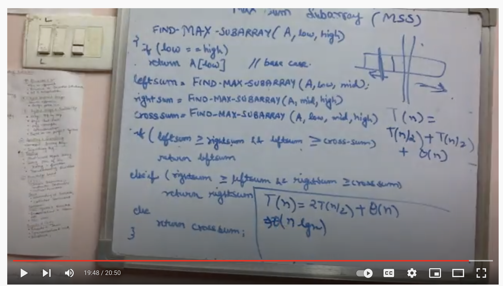
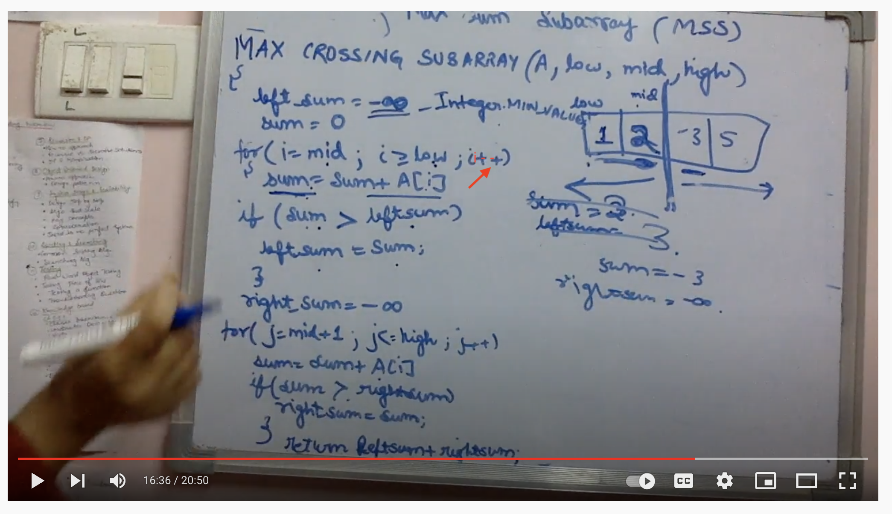

# Maximum Sub Array Sum

## Devide and Conquer 0(nlogn):

* https://www.geeksforgeeks.org/maximum-subarray-sum-using-divide-and-conquer-algorithm/

Basically there are 2 methods same like Median of 2 array (../MedianOf2Arrays/MedianOf2SortedArray/README.md)
1. Itrate 2 loop:-
    The naive method is to run two loops. The outer loop picks the beginning element, the inner loop finds the maximum possible sum with first element picked by outer loop and compares this maximum with the overall maximum. Finally return the overall maximum. The time complexity of the Naive method is O(n^2).
2. Divide and Conquer :- 
    Using Divide and Conquer approach, we can find the maximum subarray sum in O(nLogn) time. Following is the Divide and Conquer algorithm.
 
    1) Divide the given array in two halves
    2) Return the maximum of following three
    ….a) Maximum subarray sum in left half (Make a recursive call)
    ….b) Maximum subarray sum in right half (Make a recursive call)
    ….c) Maximum subarray sum such that the subarray crosses the midpoint

    The lines 2.a and 2.b are simple recursive calls. How to find maximum subarray sum such that the subarray crosses the midpoint? We can easily find the crossing sum in linear time. The idea is simple, find the maximum sum starting from mid point and ending at some point on left of mid, then find the maximum sum starting from mid + 1 and ending with sum point on right of mid + 1. Finally, combine the two and return.

* https://www.youtube.com/watch?v=9wUr2o39CDU

 

 

