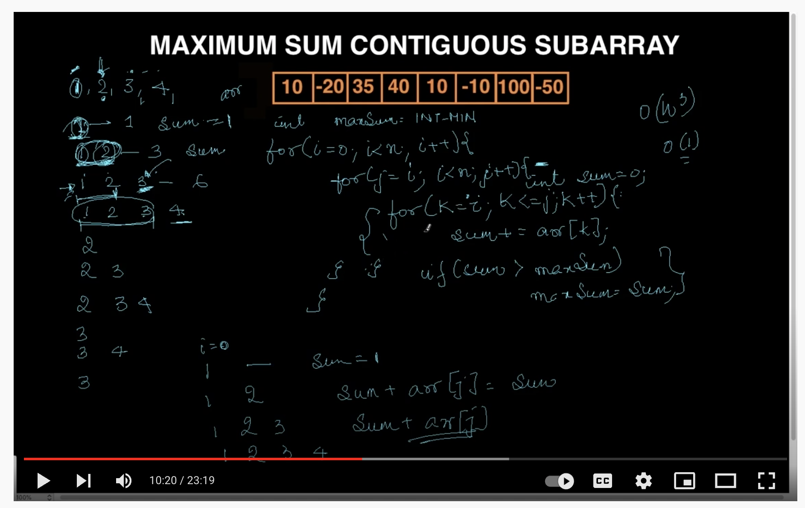
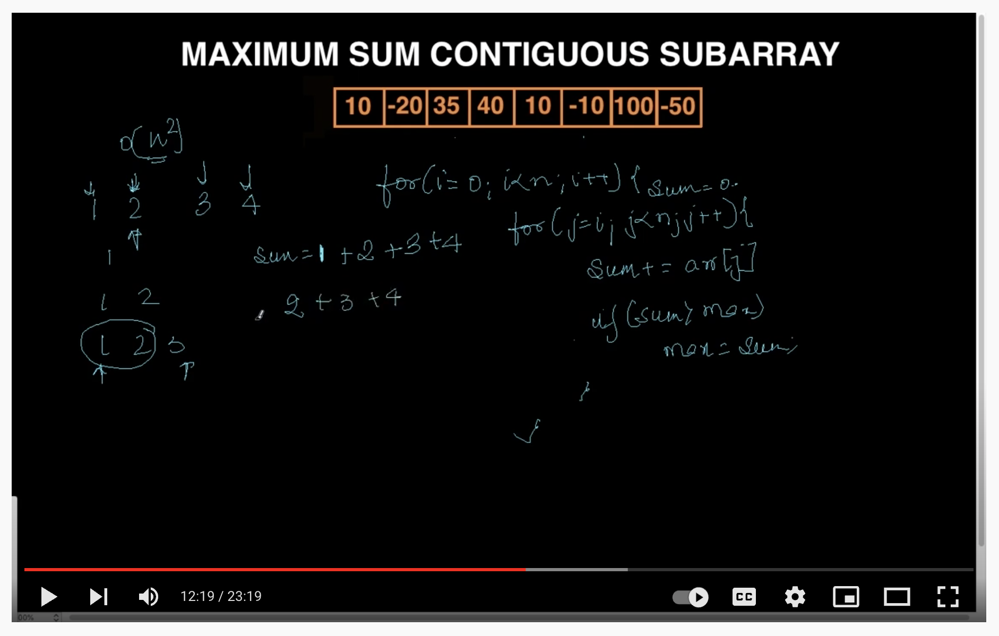

# Maximum Sub Array Sum

## Naive Approach :
https://www.youtube.com/watch?v=MSkk49c0U04

### O(n^3)
<p align="center">

</br>
</p>
1. first loop pickup outer element 
2. second loop will pickup all the elements and make sums and compare with final maxSum , "j will stats from i "
3. Third Loop will be from i to j only like k will start from i and go upto j only 
   
```
    [1,2,3,4]

    let say i = 0 then loop will go like below 
    
    1 (i =0 , j = 0 and third loop will be [1] so sum will be 0+1 = 1 )
    1 2 (i =0 , j = 1 and third loop will be [1, 2] so sum will be 1 + 2 = 3 )
    1 2 3 (i =0 , j = 2 and third loop will be [1, 2, 3] so sum will be 1 + 2 + 3 = 6 )
    1 2 3 4 (i =0 , j = 3 and third loop will be [1, 2, 3, 4] so sum will be 1 + 2 + 3 + 4 = 10 )

    maxSum = -99999
    for(i=0;i<arr.length;i++){
        for(j=i;k<arr.length;j++){
            let sum = 0
            for(k=i;k<j;k++){
                sum + = arr[k];
            }
            if(sum>maxSum){
                maxSum = sum
            }
        }
    }
```
### O(n^2)
<p align="center">

</br>
</p>
```
    [1,2,3,4]

    let say i = 0 then loop will go like below 
    
    1 (i =0 , j = 0 and third loop will be [1] so sum will be 0+1 = 1 )
    1 2 (i =0 , j = 1 and third loop will be [1, 2] so sum will be 1 + 2 = 3 )
    1 2 3 (i =0 , j = 2 and third loop will be [1, 2, 3] so sum will be 1 + 2 + 3 = 6 )
    *** Note :- 
    if u will see carefully (1+2)+3 , (1+2) we have already done in previous iteration so 
    can we store it somewhere and reuse it ?
    Yes we can store and reuse and reduce time complaxity via remove this third loop because in the third loop what we are doing 
    1. we are keep adding one by one value in newly generated sum varible (0) like 
    0
    sum(0)+1 = 1
    sum(1)+2 = 3
    sum(3)+3 = 6 
    2. Via this observation we found we are only adding current arr[j] in previous sum only 
    ***  
    1 2 3 4 (i =0 , j = 3 and third loop will be [1, 2, 3, 4] so sum will be 1 + 2 + 3 + 4 = 10 )

    maxSum = -99999
    for(i=0;i<arr.length;i++){
        let sum = 0
        for(j=i;k<arr.length;j++){
            sum + = arr[j];
            if(sum>maxSum){
                maxSum = sum
            }
        }
    }
    ```


## Divide and Conquer 

See MaximumSubArraySum-Devide&Conquer

## Kadane's Algo 
https://www.geeksforgeeks.org/largest-sum-contiguous-subarray/

kadane'sAlgorithmLargestSumContiguousSubarray