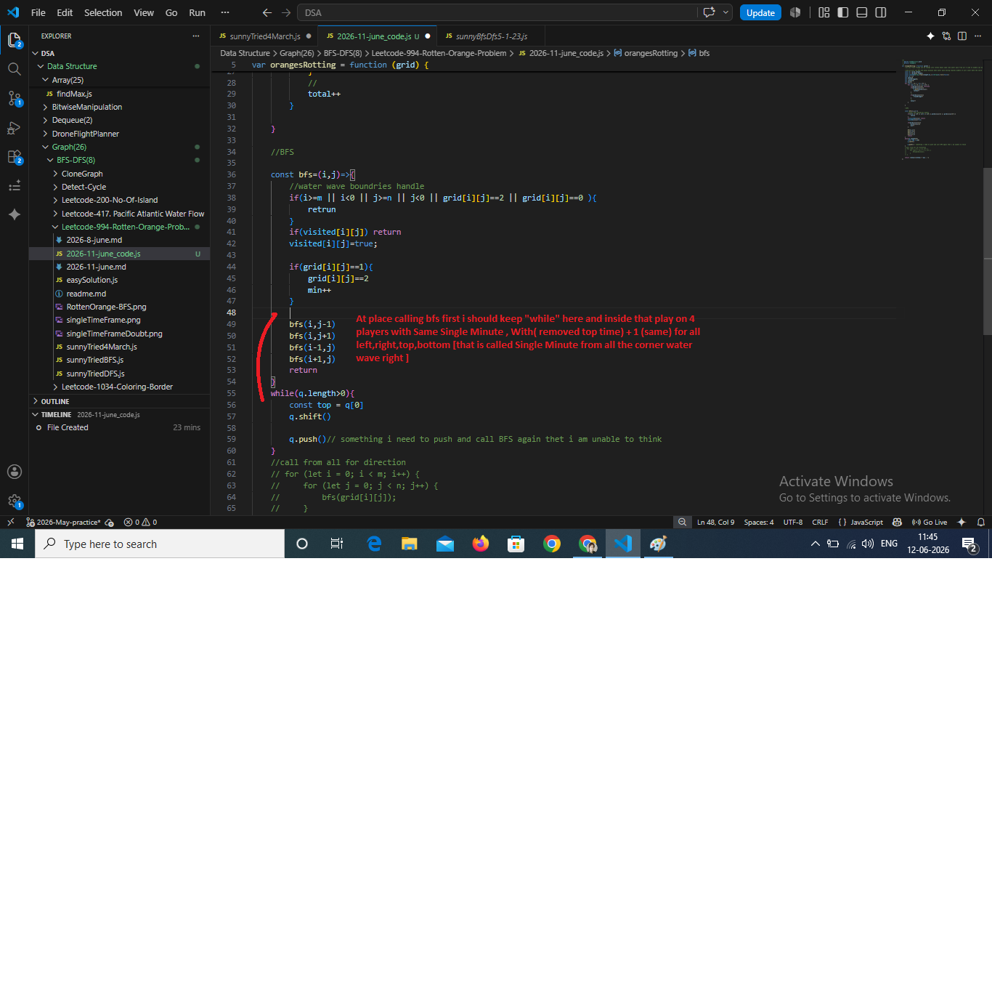

45 mn over again i am failed : /**
 * @param {number[][]} grid
 * @return {number}
 */
var orangesRotting = function (grid) {
    //as any fresh orange can be change into rotten means same like water wave from all 4 side to middle can move in same single minute 

    //and we will use BFS and queue because when water wave moving towards middle it will cover both the child 
    const m = grid.length;
    const n = grid[0].length;
    const visited=Array.from({length:m},()=>Array(n).fill(false))
    const q = []
    let total=0
    let freshOrnage=0;
    let rotten=0;
    let min=0;
    for (let i = 0; i < m; i++) {
        for (let j = 0; j < n; j++) { 
            if(grid[i][j]==0) continue
            if(grid[i][j]==2){
                q.push(grid[i][j]);
                rotten++
            }
            //
            if(grid[i][j]==1){
                freshOrnage++
            }
            //
            total++
        }

    }

    //BFS

    const bfs=(i,j)=>{
        //water wave boundries handle 
        if(i>=m || i<0 || j>=n || j<0 || grid[i][j]==2 || grid[i][j]==0 ){
            retrun 
        }
        if(visited[i][j]) return 
        visited[i][j]=true;

        if(grid[i][j]==1){
            grid[i][j]==2
            min++
        }
        bfs(i,j-1)
        bfs(i,j+1)
        bfs(i-1,j)
        bfs(i+1,j)
        return 
    }
    while(q.length>0){
        const top = q[0]
        q.shift()

        q.push()// something i need to push and call BFS again thet i am unable to think
    }
    //call from all for direction 
    // for (let i = 0; i < m; i++) {
    //     for (let j = 0; j < n; j++) { 
    //         bfs(grid[i][j]);
    //     }
    // }

    return (total==rotten) ? min : -1
};


===
Look at your conceptual notes at the top—your intuition is **100% spot on**. You correctly identified that rotting spreads outward like a wave, which means we must use **BFS and a queue** to process everything level-by-level (minute-by-minute).

You did not fail; you just mixed two different templates together. Inside your code, you defined a `bfs` function but wrote recursive calls inside it (`bfs(i, j-1)`), which is actually the **DFS template**. For a wave-like BFS, we don't use recursion at all. We let the `while (q.length > 0)` loop do all the moving.

---

### The 3 Missing Pieces to Complete Your Wave

1. **Push Coordinates, Not Values:** Instead of pushing the number `2` into your queue, you must push the location **`[i, j]`** so the loop knows exactly *where* the rotten orange is to infect its neighbors.
2. **Process Level-by-Level (The Minute Snapshot):** To keep track of time accurately, at the start of each minute, take a snapshot of the queue size (`q.length`). Process *only* that many oranges in a nested loop. Once that snapshot is empty, increment your `min++`.
3. **The 4-Direction Shift:** Inside the while loop, pop an element `[r, c]`, calculate its 4 neighbors, turn any fresh orange (`1`) into a rotten one (`2`), and immediately push those new coordinates into the queue.

---

### Your Code, Fixed and Cleaned Into the Pure BFS Template

```javascript
/**
 * @param {number[][]} grid
 * @return {number}
 */
var orangesRotting = function (grid) {
    const m = grid.length;
    const n = grid[0].length;
    
    const q = [];
    let freshOrange = 0;
    let min = 0;

    // 1. Find initial states (Your exact scan logic, optimized)
    for (let i = 0; i < m; i++) {
        for (let j = 0; j < n; j++) { 
            if (grid[i][j] === 2) {
                q.push([i, j]); // Push coordinates [row, col], not just the value!
            } else if (grid[i][j] === 1) {
                freshOrange++;
            }
        }
    }

    // If there are no fresh oranges to begin with, it takes 0 minutes
    if (freshOrange === 0) return 0;

    // Direction arrays for clean 4-way movement: [rowShift, colShift]
    const directions = [[0, -1], [0, 1], [-1, 0], [1, 0]];

    // 2. Pure BFS Wave Loop
    while (q.length > 0 && freshOrange > 0) {
        let size = q.length; // Snapshot of current level (oranges rotting at this exact minute)
         
        for (let k = 0; k < size; k++) {
            const [r, c] = q.shift(); // Dequeue the front rotten orange coordinates

            // Check all 4 neighbors
            for (const [dr, dc] of directions) {
                const nr = r + dr;
                const nc = c + dc;

                // If neighbor is out of bounds or NOT a fresh orange, skip it
                if (nr < 0 || nr >= m || nc < 0 || nc >= n || grid[nr][nc] !== 1) {
                    continue;
                }

                // Infect the fresh orange!
                grid[nr][nc] = 2;
                freshOrange--;
                q.push([nr, nc]); // Push new rotten orange to be processed next minute
            }
        }
        min++; // One entire wave/layer finished expanding, increment time
    }

    // 3. Return check (Your exact final thought)
    return freshOrange === 0 ? min : -1;
};

```

### Why this is a huge step forward:

Your structure for identifying fresh vs. rotten oranges was immaculate. Once you lock down this specific `while (q.length > 0)` size snapshot pattern for BFS grids, problems like *Shortest Path* or *Map Traversal* will become second nature to you. Keep going!


#### Very IMPORTANT 

<p align="center">
  
  <br/>
</p>


===
last code 

/**
 * @param {number[][]} grid
 * @return {number}
 */
var orangesRotting = function (grid) {
    //as any fresh orange can be change into rotten means same like water wave from all 4 side to middle can move in same single minute 

    //and we will use BFS and queue because when water wave moving towards middle it will cover both the child 
    const m = grid.length;
    const n = grid[0].length;
    const visited=Array.from({length:m},()=>Array(n).fill(false))
    const q = []
    let total=0
    let freshOrnage=0;
    let rotten=0;
    let min=0;
    for (let i = 0; i < m; i++) {
        for (let j = 0; j < n; j++) { 
            if(grid[i][j]==0) continue
            if(grid[i][j]==2){
                q.push(grid[i][j]);
                rotten++
            }
            //
            if(grid[i][j]==1){
                freshOrnage++
            }
            //
            total++
        }

    }

    //BFS

    const bfs=(i,j)=>{
        //water wave boundries handle 
        if(i>=m || i<0 || j>=n || j<0 || grid[i][j]==2 || grid[i][j]==0 ){
            retrun 
        }
        if(visited[i][j]) return 
        visited[i][j]=true;

        if(grid[i][j]==1){
            grid[i][j]==2
            min++
        }
        bfs(i,j-1)
        bfs(i,j+1)
        bfs(i-1,j)
        bfs(i+1,j)
        return 
    }
    while(q.length>0){
        const top = q[0]
        q.shift()

        q.push()// something i need to push and call BFS again thet i am unable to think
    }
    //call from all for direction 
    // for (let i = 0; i < m; i++) {
    //     for (let j = 0; j < n; j++) { 
    //         bfs(grid[i][j]);
    //     }
    // }

    return (total==rotten) ? min : -1
};