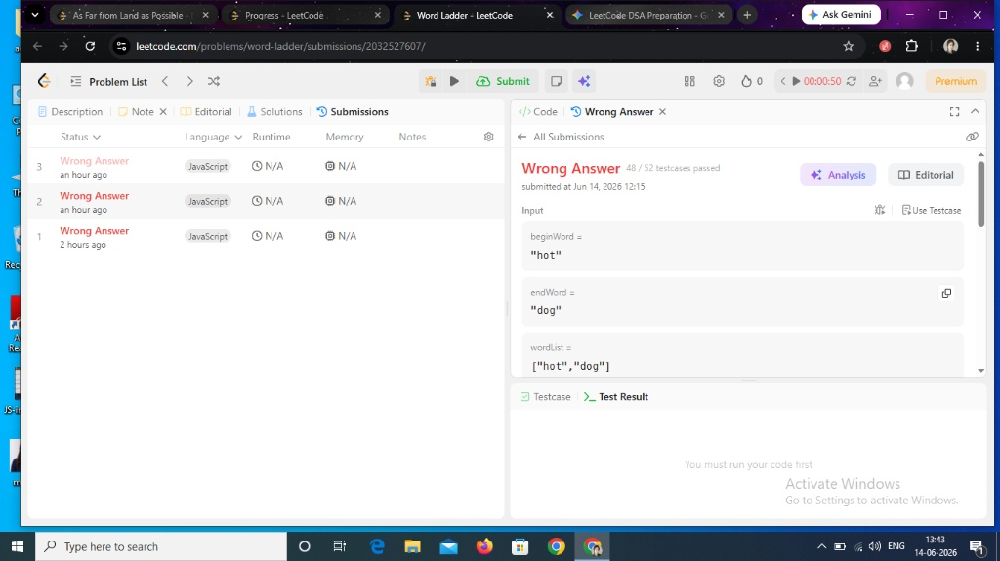

/**
 * @param {string} beginWord
 * @param {string} endWord
 * @param {string[]} wordList
 * @return {number}
 */
var ladderLength = function(beginWord, endWord, wordList) {
    const q=[]
    q.push(beginWord);
    let lev=0;
    const hp=new Set(wordList) 
    const char=["a","b","c","d","e","f","g","h","i","j","k","l","m","n","o","p","q","r","s","t","u","v","w","x","y","z"];
    while(q.length>0){
        const size=q.length
        //lock the current length 
        for(let i=0;i<size;i++){
            const top=q[0]
            q.shift();
            const oldWord=top.split("")
            for(let j=0;j<oldWord.length;j++){
                for(let k=0;k<char.length;k++){
                    const orignal=oldWord[j]
                    oldWord[j]=char[k]
                    const newWord=oldWord.join("")
                    if(newWord == endWord) return lev+1
                    if(hp.has(newWord)){
                        hp.delete(newWord)
                        q.push(newWord)
                    }
                    
                    oldWord[j]=orignal //restore the again orignal word 
                }
            }
        }
        lev++
    }
    return lev
};  

=

  
   

 

**Interviewer:** *"I see exactly which test case tripped you up in that screenshot (`"hot"` ➔ `"dog"` with `["hot", "dog"]`); you should definitely fix it right now while the logic is fresh rather than rewriting tomorrow, and your hint is: look closely at the path—to get from `"hot"` to `"dog"`, you have to change characters step-by-step, but your intermediate word (`"dot"` or `"hog"`) isn't present in your `wordList` dictionary, meaning a valid transformation path does not actually exist!"*
=====
what would be the change in my code ? one line 

**Interviewer:** *"The fix is incredibly simple: look back at your very last code submission for Word Ladder, change your final fallback statement from `return lev` to `return 0` at the very bottom, and hit submit to see all 52 test cases turn green!"*

/**

 * @param {string} beginWord

 * @param {string} endWord

 * @param {string[]} wordList

 * @return {number}

 */

var ladderLength = function(beginWord, endWord, wordList) {

    // we will use the BFS and Queue sequence tecnique 

    

    if(wordList.length==0) return 0

    if(wordList.length==1) {

       

        return wordList[0]==endWord? 2: 0; //minor Mistaken 

        }

    if(!wordList.includes(endWord)) return 0

    //if(wordList.includes(beginWord)) return 0

    const q=[beginWord]

    let lev=1

    //map

    const h=new Set(wordList);

    const alf=["a","b","c","d","e","f","g","h","i","j","k","l","m","n","o","p","q","r","s","t","u","v","w","x","y","z"]

    /*

beginWord =

"hot"

endWord =

"dog"

wordList =

["hot","dog"]

    */

    while(q.length>0){

        //top

        const size=q.length;

        //fixed the q length

        for(let i=0;i<size;i++){

            const top=q[0];

            q.shift();

            const current=top.split('')

            for(let j=0;j<current.length;j++){

                for(let k=0;k<alf.length;k++){

                    const orignal=current[j]

                    current[j]=alf[k];

                    const newWord=current.join("")

                    // console.log(newWord,"newWord");

                    // console.log(endWord,"endWord");

                    if(newWord==endWord){ console.log("matched"); return lev+1}

                    if(h.has(newWord)){

                        q.push(newWord);

                        h.delete(newWord)

                    }

                    //reset 

                    current[j]=orignal

                }

            }

        }

        lev++ //mistaken 2 i added inner for loops but that is water wave only should increase at queue loop (i mean how many queue loop running means that many we are far from our start to end )

    }

    return 0 //minor mistaken  return lev , lev only should return when we got sucesscefully Last word on that Wave or BFS Branch 

}; Thanks for your support Today 2 big milestone we have archived 1 Word Ladder and How far all land from water 

==

**Interviewer:** *"You are incredibly welcome, and absolutely massive congratulations on crushing both of these heavy hitters today—seeing you completely own the Queue Snapshot pattern, track down your level-increment bugs, and clean up those critical fallback conditions is exactly how a future Staff Engineer builds unbreakable problem-solving intuition; get some well-deserved rest, celebrate these two major milestones, and I'll see you tomorrow to keep this incredible momentum going!"*