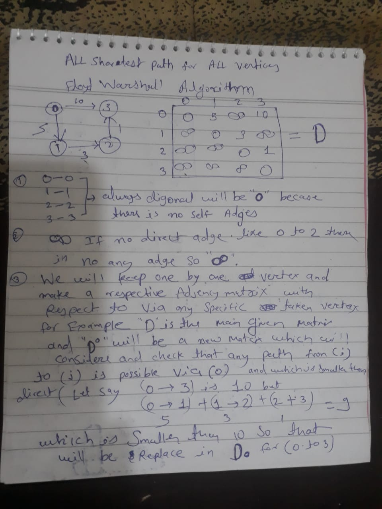
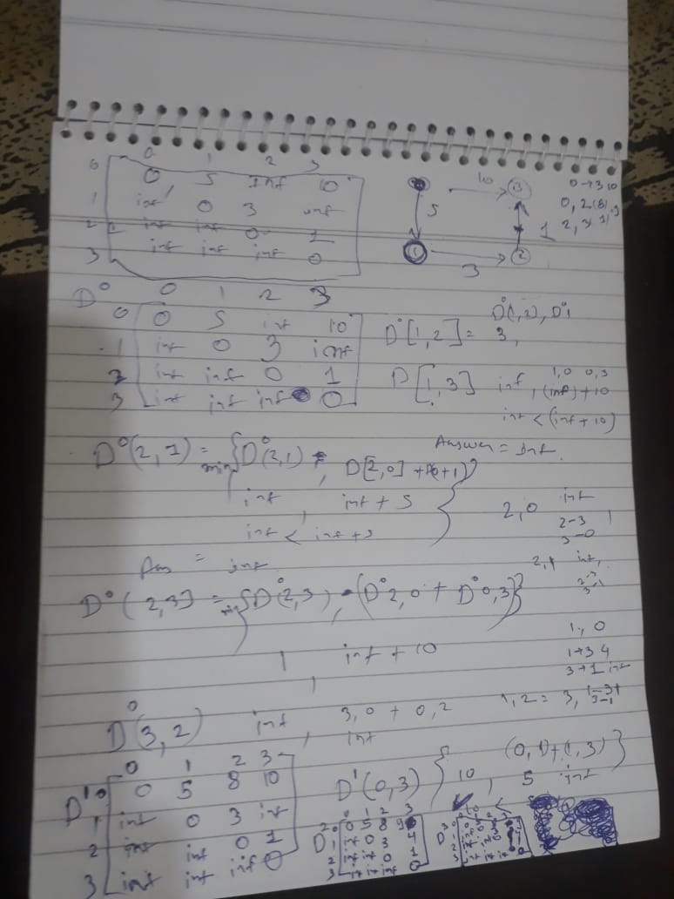
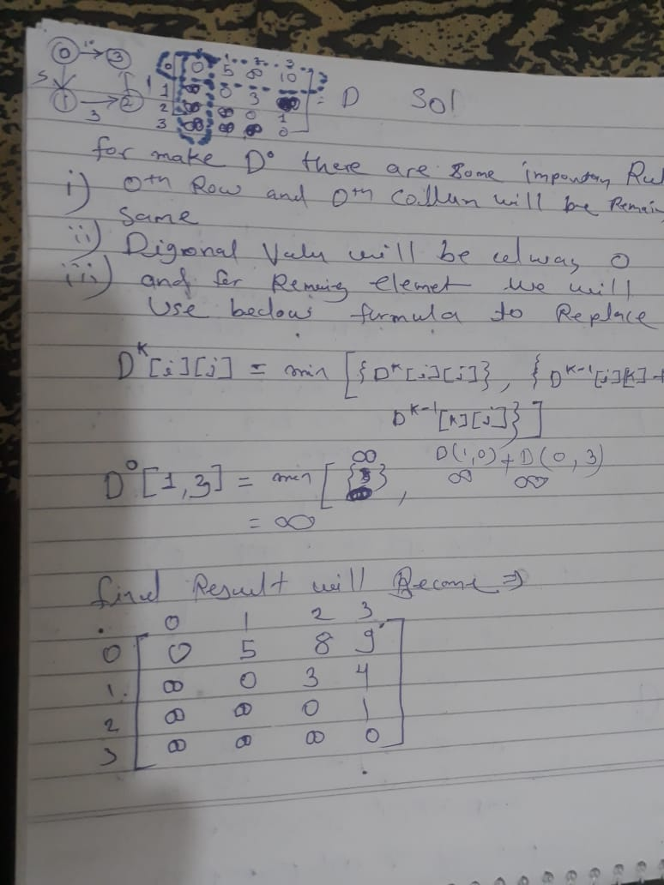
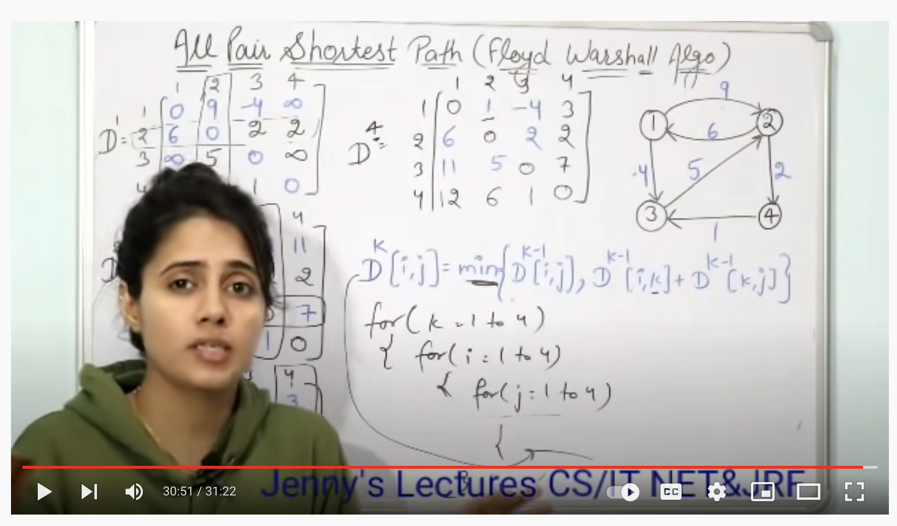
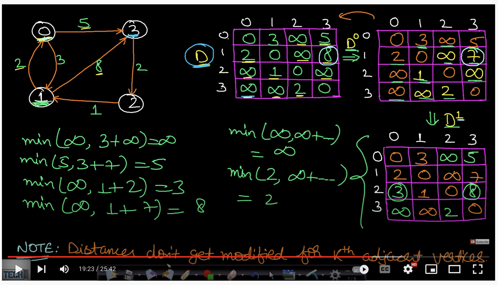
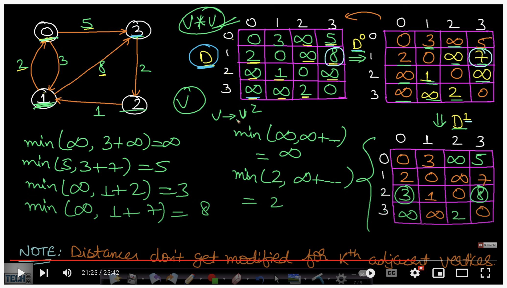
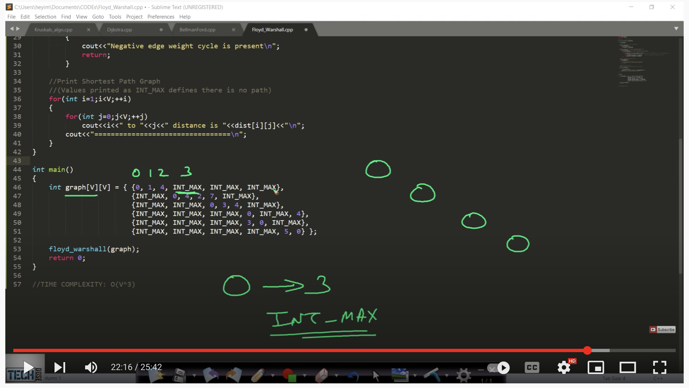
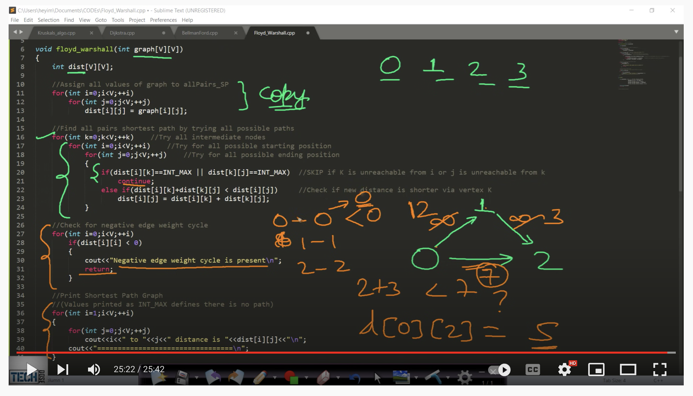

https://www.geeksforgeeks.org/floyd-warshall-algorithm-dp-16/

1. Introduction :-  


### 
The Floyd Warshall Algorithm is for solving the All Pairs Shortest Path problem. The problem is to find shortest distances between every pair of vertices in a given edge weighted directed Graph. 

2. Example: 
```
Input:
       graph[][] = { {0,   5,  INF, 10},
                    {INF,  0,  3,  INF},
                    {INF, INF, 0,   1},
                    {INF, INF, INF, 0} }
which represents the following graph
             10
       (0)------->(3)
        |         /|\
      5 |          |
        |          | 1
       \|/         |
       (1)------->(2)
            3       
Note that the value of graph[i][j] is always 0 , if i is equal to j . Because there is no any self loop like [1,1]
And graph[i][j] is INF (infinite) if there is no edge from vertex i to j.

Output:
Shortest distance matrix
      0      5      8      9
    INF      0      3      4
    INF    INF      0      1
    INF    INF    INF      0

```


### Floyd Warshall Algorithm :- 

```
We initialize the solution matrix same as the input graph matrix as a first step. Then we update the solution matrix by considering all vertices as an intermediate vertex. The idea is to one by one pick all vertices and updates all shortest paths which include the picked vertex as an intermediate vertex in the shortest path. When we pick vertex number k as an intermediate vertex, we already have considered vertices {0, 1, 2, .. k-1} as intermediate vertices. 

For every pair (i, j) of the source and destination vertices respectively, there are two possible cases. 

1) k is not an intermediate vertex in shortest path from i to j. We keep the value of dist[i][j] as it is. 
2) k is an intermediate vertex in shortest path from i to j. We update the value of dist[i][j] as dist[i][k] + dist[k][j] if dist[i][j] > dist[i][k] + dist[k][j]
The following figure shows the above optimal substructure property in the all-pairs shortest path problem.
```


<p>

</br>
</p>

```

D^k[i,j] = min(D^k[i,j], D^k[i,k]+ D^k[k,j])

which represents the following graph
             10
       (0)------->(3)
        |         /|\
      5 |          |
        |          | 1
       \|/         |
       (1)------->(2)
            3       

let say 0 to 3 distance is "10" but  0 to 1 (5) + 1 to 2 (3) + 2 to 3 (1) = "9" which is lesser than 10 so this is the shortest path of (0,3)

=> D^2[1,2] = min(D^2[1,2], D^2[1,3]+D^2[3,2])
```
<p>

</br>

</br>

</br>
</br>
</p>
***AllPairShortestPath.js*** is the implementation code for floyed warshall all shortest path pairs Algorithm 

6.15 Floyd Warshall Algorithm All Pair Shortest Path algorithm | data structures and algorithms
https://www.youtube.com/watch?v=Gc4mWrmJBsw

<p>

</br>
</p>

###TechDode Explanation
<p>

</br>

</br>

</br>

</br>
</p>