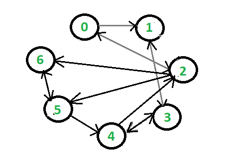
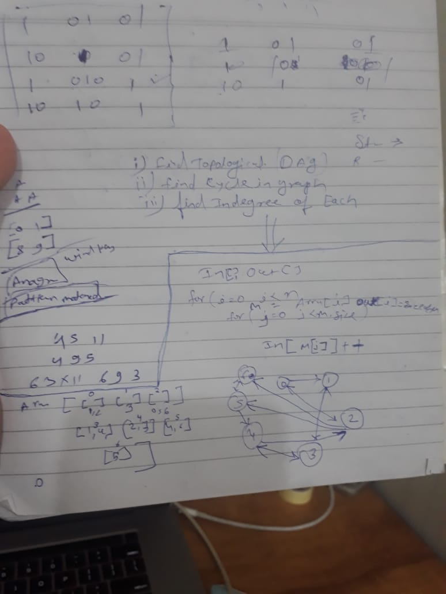

https://www.geeksforgeeks.org/finding-in-and-out-degrees-of-all-vertices-in-a-graph/

 

 

# steps :-
1. Add all the adge one by one in Array like 0 index [1,2] why because from 0th vertex two vertex are going out side 
   So Array would be like 
   Array AdgeArray = [[1,2],[3],[0,5,6],[1,4],[2,3],[4,6],[5]]
2. Two Array Indegree=[], outdegree=[]
2. ittrate 2 for loop 
   1. first for loop (i to lenth of Adge Array)
      and push one by one current index Array size to outdegree
      like at index i = 0 value is [1,2] and the lenth of this value array is 2
      like at index i = 1 value is [3] and the lenth of this value array is 1
      outdegree[2,1,3,2,2,2,1]
    2. second loop (j=0 to length of AdgeArray[i])
       like 
       at i =0 M=[1,2] inner loop will be ittrate 2 times becaise AdgeArray[0] is [1,2]
       and the pickup value of inner loop and increment in Indegree element 
       like 
       Indegree[M[j]]++ means it will increase the indegree of j(1) to 1 
       Indegree[M[j]]++ means it will increase the indegree of j(2) to 1 