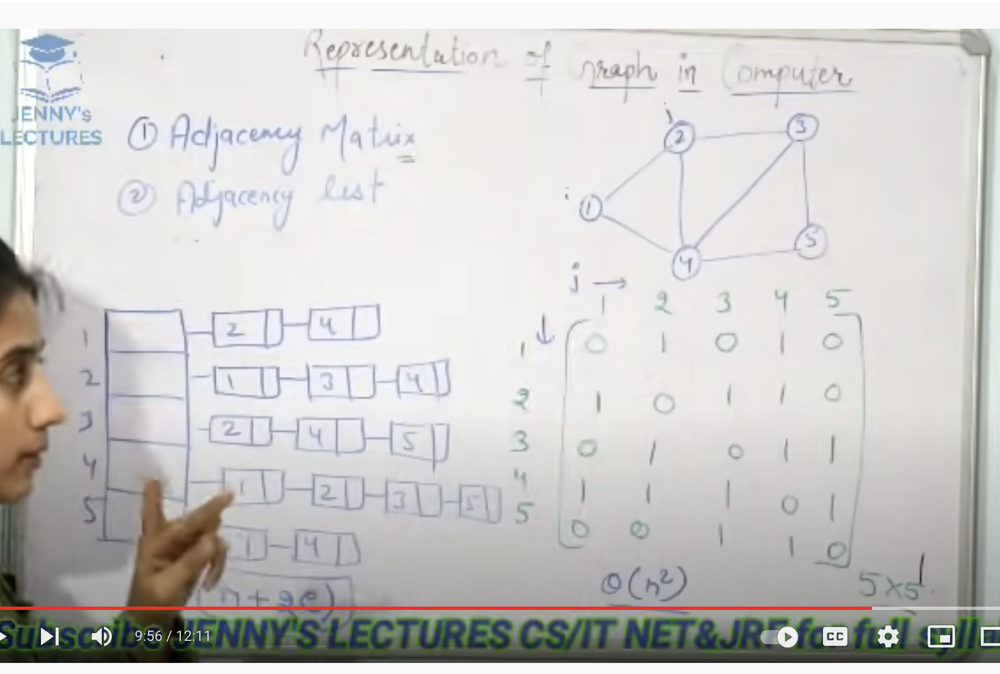
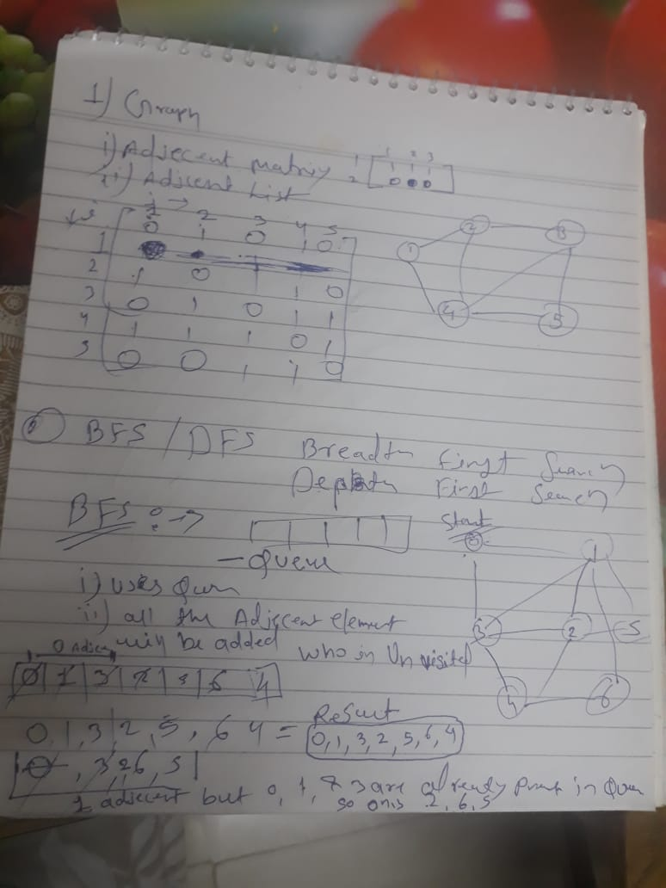

## Graph 

  
   

### Introduction
1. Directed Graph
2. Undirected Grapg 

### BFS / DFS
1. Implemantation Of DFS and BFS 

  
   

  
   

### Applications Of DFS

### Mother Vertex of Graph using DFS 

### Transitive Closuer in Graph using DFS 

### Find a circle in Directed Graph :-

1. Find Cycle in indirected graph
    https://www.youtube.com/watch?v=vXrv3kruvwE
2. Find Cycle in directed graph
    https://www.youtube.com/watch?v=AK7BuT5MgU0

### Topological Sort in Graph :-

https://stackoverflow.com/questions/59332039/is-there-an-algorithm-to-find-the-minimum-cost-path-in-a-directed-rooted-tree-a#:~:text=The%20minimum%20cost%20path%20for,for%20its%20minimum%20cost%20path.

Timestamps
0:00 - Introduction
   
1:06 -  Prerequisites
  1. Recursion used in DFS 
  2. Stack
  3. Queue Used in BFS 
  4. Tree
2:13 -  Basic Terminologies
  1. vertex and adges  
  2. Adjency vertex
  3. Path in graph
  4. Connected Graph
  5. Connected componanat in graph
  6. Directed and Undirected Graph 
  7. Weighted and unweighted Graph
3:07 -  Representation of Graph
  1. Adjency List
  2. Adjency Matrix
  3. Edge List 
3:47 - Basic BFS/DFS Questions
  1. Print DFS / BFS
  2. Is Graph Connected 
  3. Print All Connected Componanat Of Graph 
4:38 - Applications of BFS/DFS
  1. Is Graph Tree or not 
  2. Colour the graph
  3. Largest Island 
  4. Count Node with in K Distance 
5:49 - MST - Minimum Spanning Tree
  1. Kruskal Algorithm
  2. Detect Cycle in graph
  3. Union Find Algorithm 
  4. Prims Algorithm
6:37 - Shortest Path in Directed Graph
  1. Dijkstra's Algo  
7:13 - Topological Sort
  1. Kahn's Algorithm 
  2. 
7:45 - Graphs in Matrix
  1. Snack And Loader 
  2. Rotting Orange
  3. Shortest path in Binary Matrix  
  4. Tree
8:44 - Other Questions
9:00 - Other Algorithms - Competitive Programming
  1. Bellman Ford Algorithm 
  2. Floyed warshall
  3. Strongly connected components {Tarjen's Algorithm}  
  4. Tree