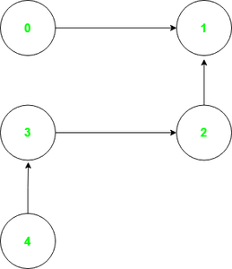

https://leetcode.com/problems/minimum-number-of-vertices-to-reach-all-nodes/
https://www.geeksforgeeks.org/smallest-set-of-vertices-to-visit-all-nodes-of-the-given-graph/?ref=gcse

Leetcode 1557. Minimum Number of Vertices to Reach All Nodes

https://www.youtube.com/watch?v=KnMkXLydu7g

<p align="center">

</br>
</p>

# Steps :-
1. Given adge array = [[0, 1], [2, 1], [3, 2], [4, 3]] and 
    create 2 Map() Array 1. graph 2. indegree and 
    Result Array []
2. ittrate adge loop as object  
    { //for loop start
        DT object will be [key,value] DT[0] is key and DT[1]
3. fill graph Map in {key,value} pair from the adge array 
   Let say at 0th index value of Adge array is [0,1]
   so we will set in graph map in term of key and value , "key" will be the first value of [0,1] is 0 and 
   "value" will be second value of [0,1] is 1 
   Garph Map will look like that 
   ```
    0: {0 => 1}
    1: {2 => 1}
    2: {3 => 2}
    3: {4 => 3}
    size: 4
   ``` 
4. Fill Indegree Map with the help of current vertex adge array "value" [0,1] mean "1" 
   if(exist DT[1]) then increment 1 in existing other wise add 1
5. } // for loop end 
6. Now ittrate the graph map entries {
    current entry = [key,value]
     and check if entry key is not exist in "Indegree" keys then 
     Push in Result
7. print the Result Array .