https://www.youtube.com/watch?v=dis_c84ejhQ

# Topological Sort Theory 

    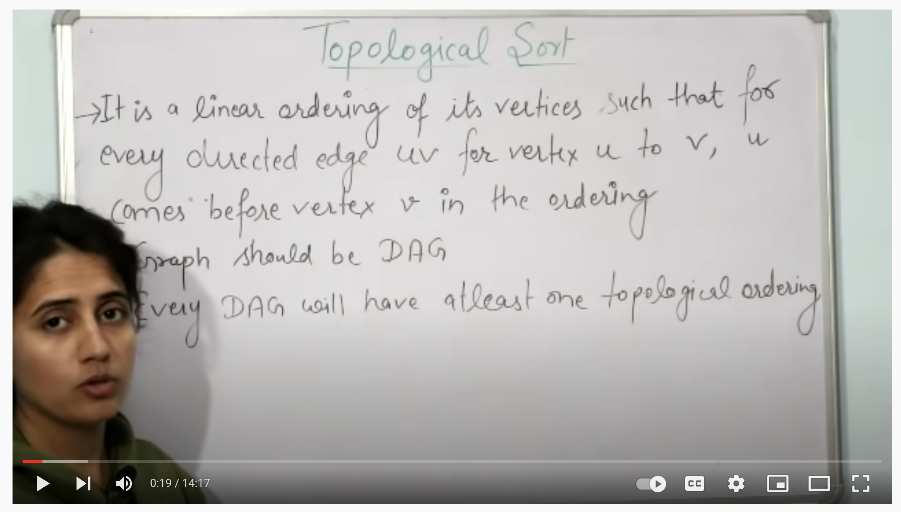
     

    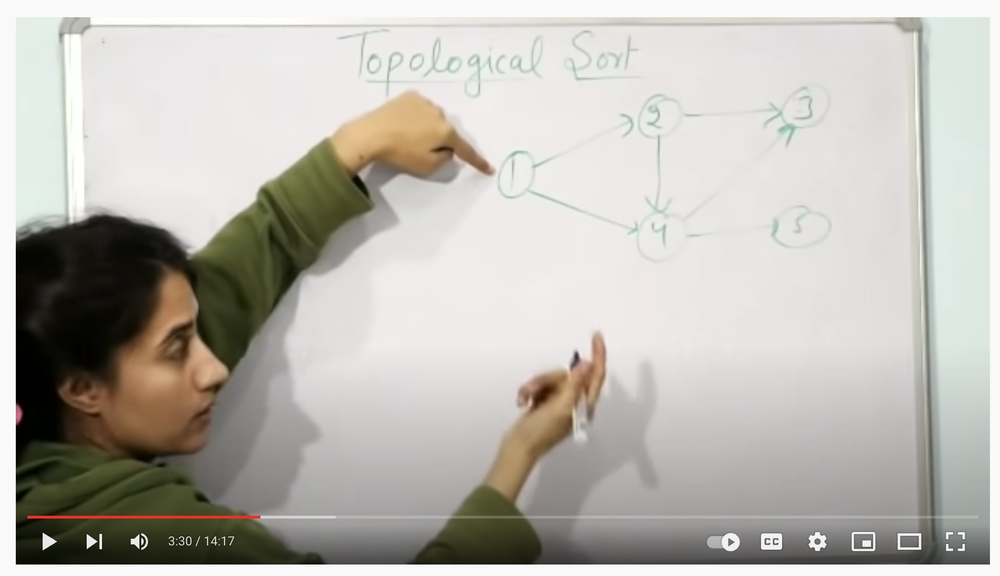
     

    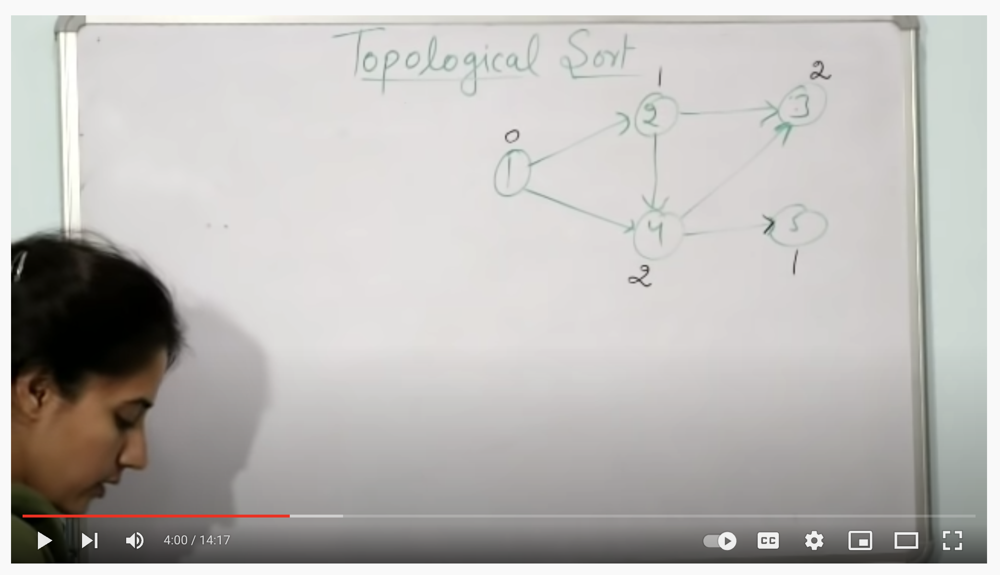
     

    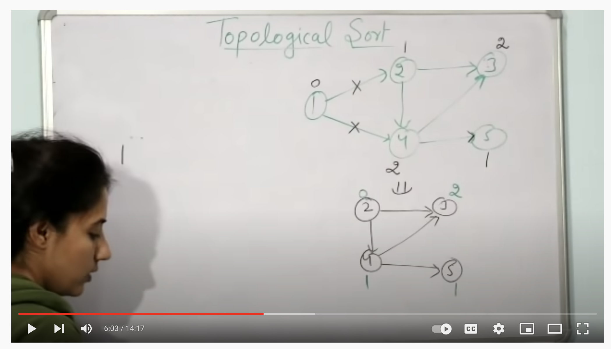
     

    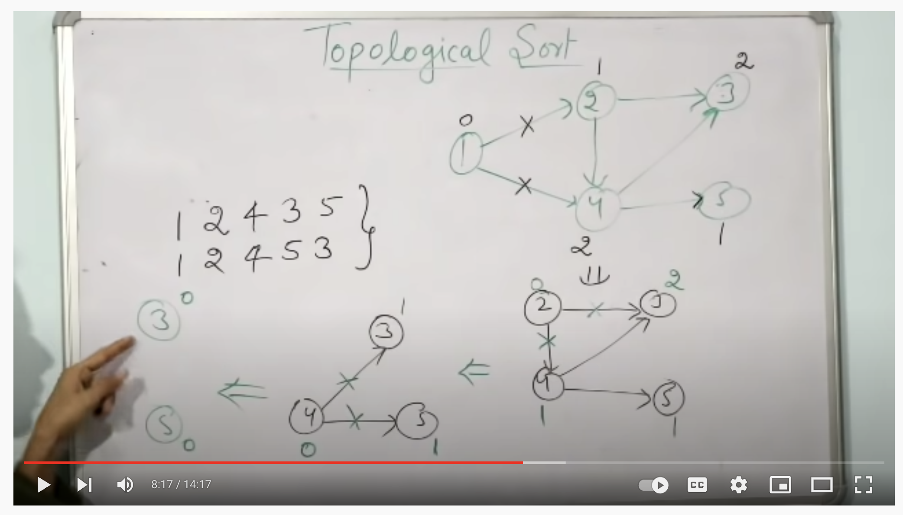
     

# Self Study 

    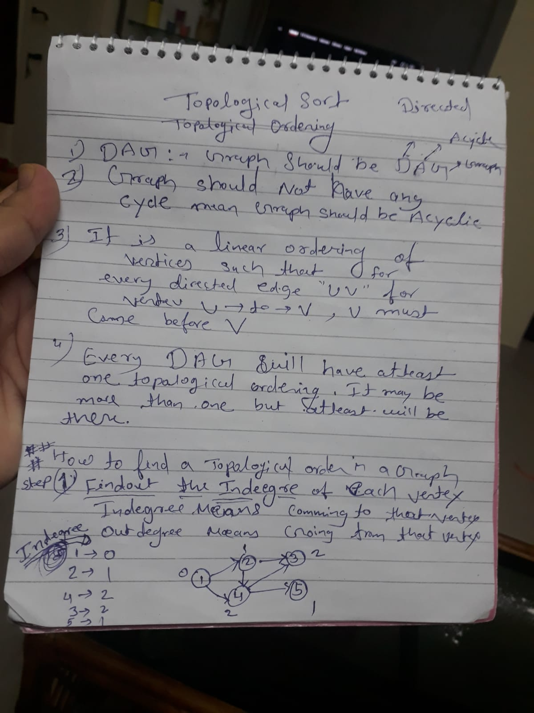
     

    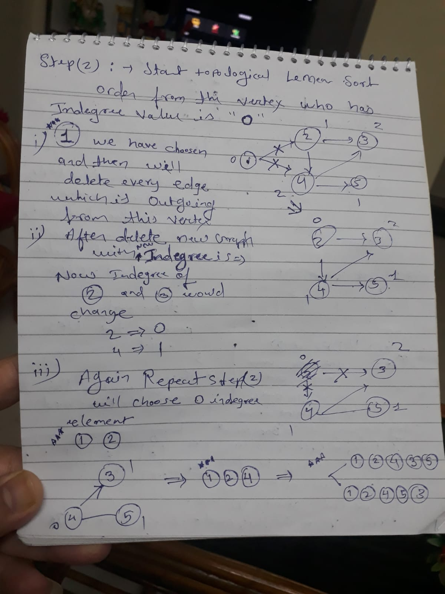
     

    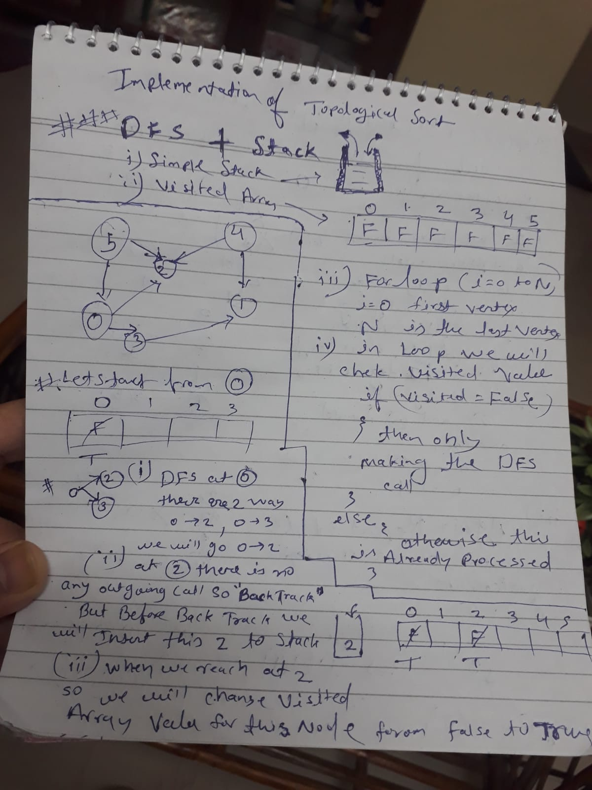
     

    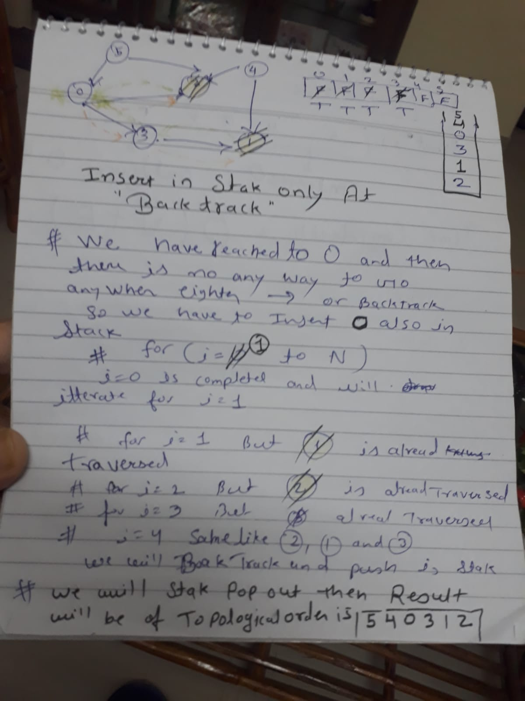
     

    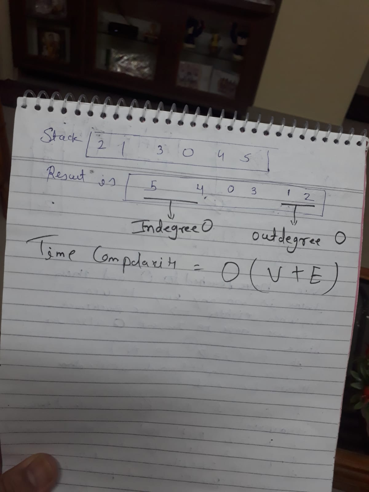
     

# Topological Sort Implementation  

    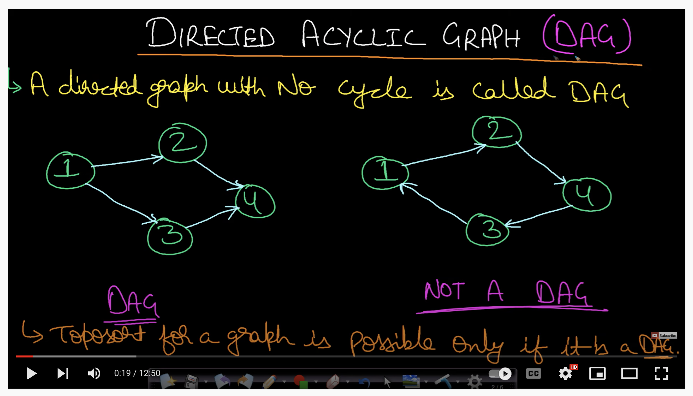
     

    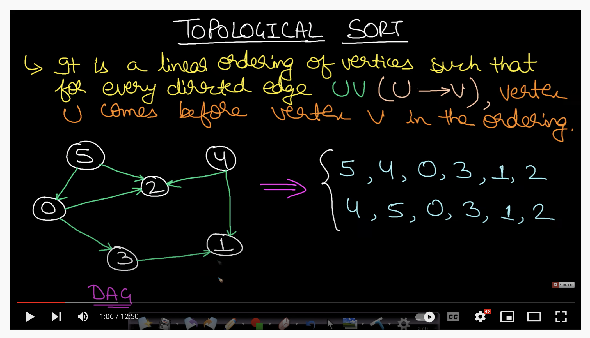
     

    
     

    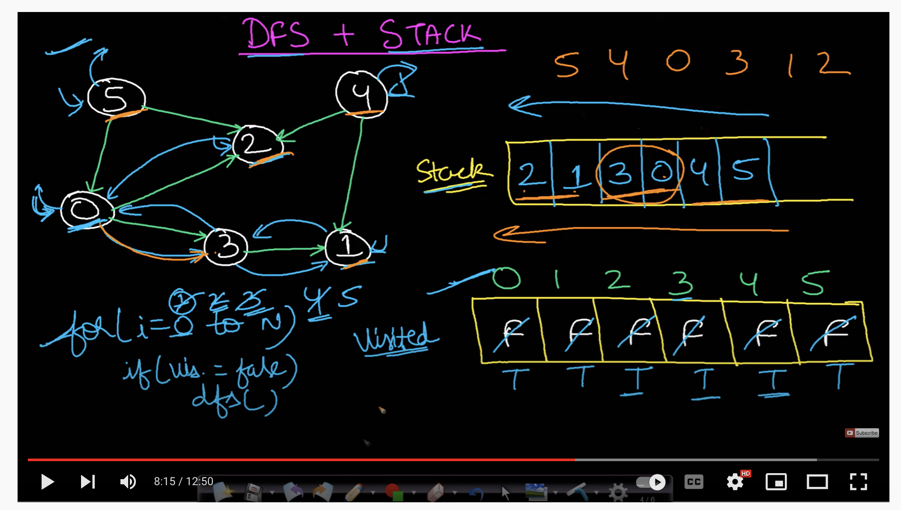
     

# Course schedule 2 | Leetcode #210 

    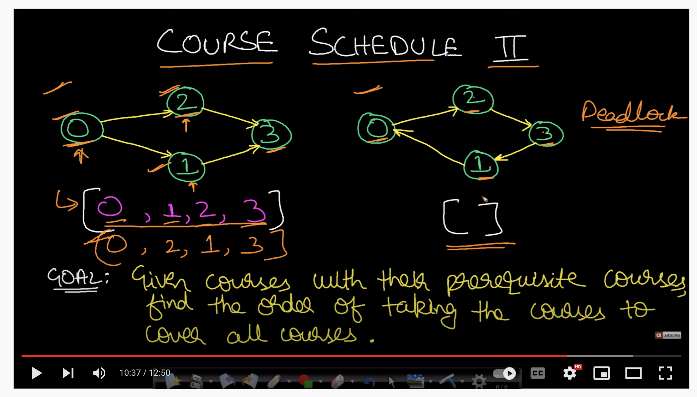
     

# Course schedule 2 | Leetcode #210 

    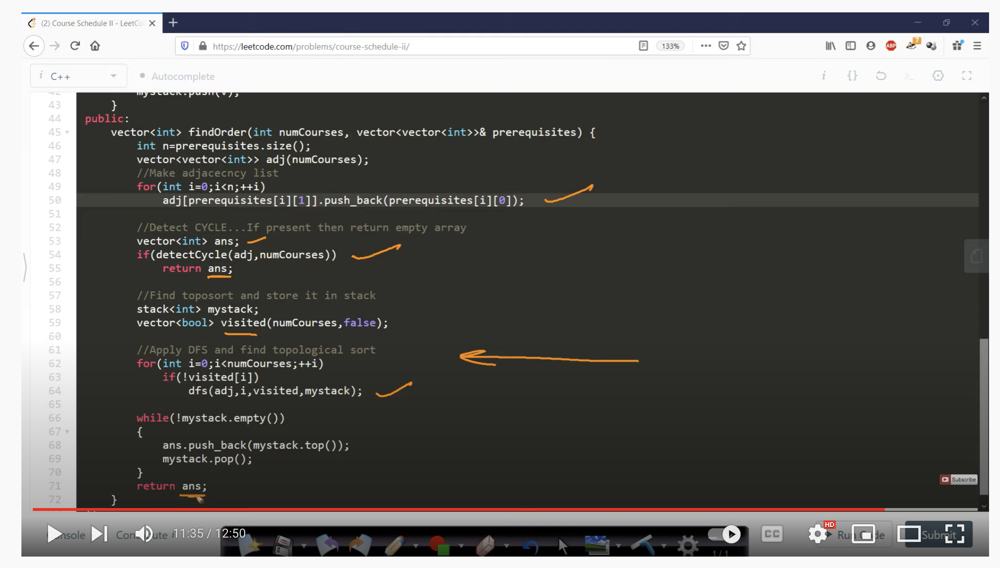
     

