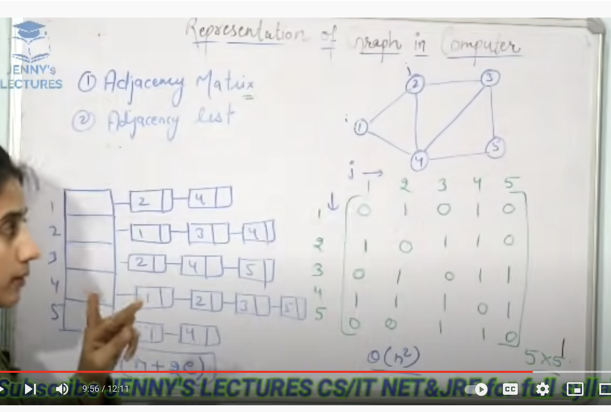
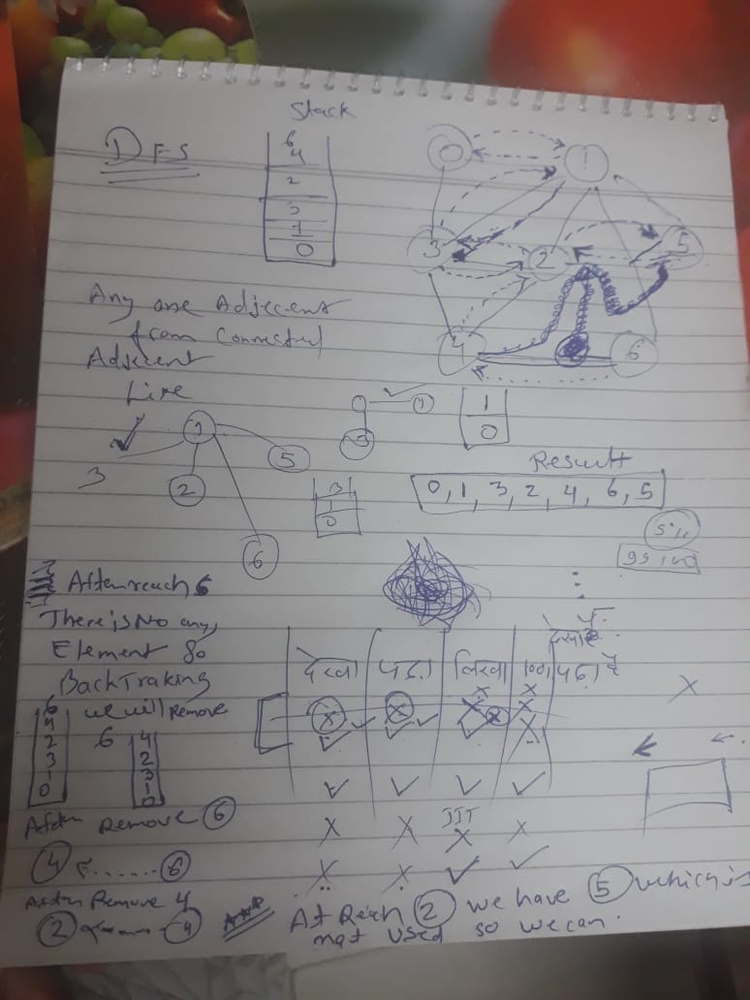
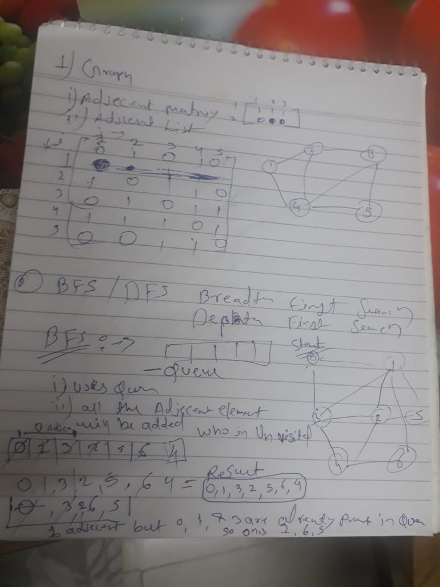

## Graph 

  
   

### Introduction
1. Directed Graph
2. Undirected Grapg 

### BFS / DFS
1. Implemantation Of DFS and BFS 

  
   

  
   

### Applications Of DFS

### Mother Vertex of Graph using DFS 

### Transitive Closuer in Graph using DFS 

### Find a circle in Directed Graph :-

1. Find Cycle in indirected graph
    https://www.youtube.com/watch?v=vXrv3kruvwE
2. Find Cycle in directed graph
    https://www.youtube.com/watch?v=AK7BuT5MgU0

### Topological Sort in Graph :-
