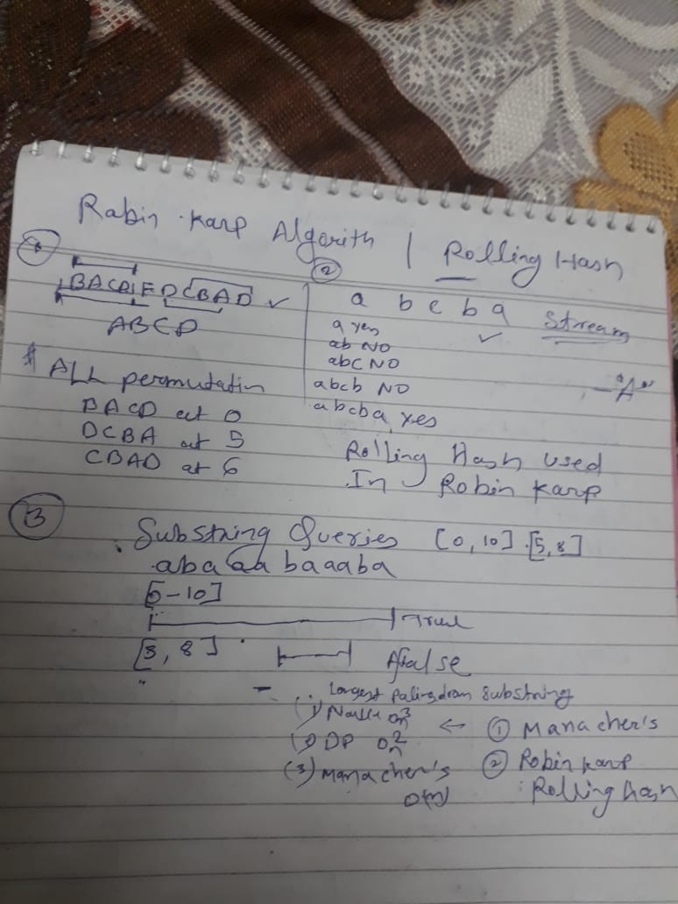

Rabin Karp Algo 

https://www.geeksforgeeks.org/rabin-karp-algorithm-for-pattern-searching/

Explanation :- 

https://www.youtube.com/watch?v=bmy5RrkgVqQ

Steps :- 

text = [A A B A A C B A A ]
pattern = [B A A] 

1. Broute force method :-
   1. we can take a window size of equal to the pattern size [A A B]
   2. we can match every character in string [A A B A A C B A A ] one by one with current window elements [B A A] if no match change the window 
   3. which will take O( length of string N * Length of pattern M )
2. KMP Algorithm Or alternative Approach is Rabin Karp Rolling Hash :-
   1. Sliding Window with pattern length 
   2. Fill 2 different Hash Value compute one by pattern and another via current window  
   3. Normal Hash Function (Compare if hash count is equal of pattern and current window):-
      A B C 
      | | |
      1 2 3

      normal hash calculation will be 6 
      which is equal to 

      B B B
      | | |
      2 2 2

      Total = 6 

      [A B C] [B B B] == 6 , then we have to unnecesory go inside and compare each element (collision)
      * for stop this collision we have to use a special 
   4. Special Hash Code Strict check hash without collision (Rolling Hash)
      [B A A] 
       | | |
       2 1 0 index
       2 1 1 hash value with the halp of character code 

       (((2 * 26 ^ 2 ) %p + (1 * 26 ^ 1 ) ) %p + 1 * 26 ^ 0) %p 