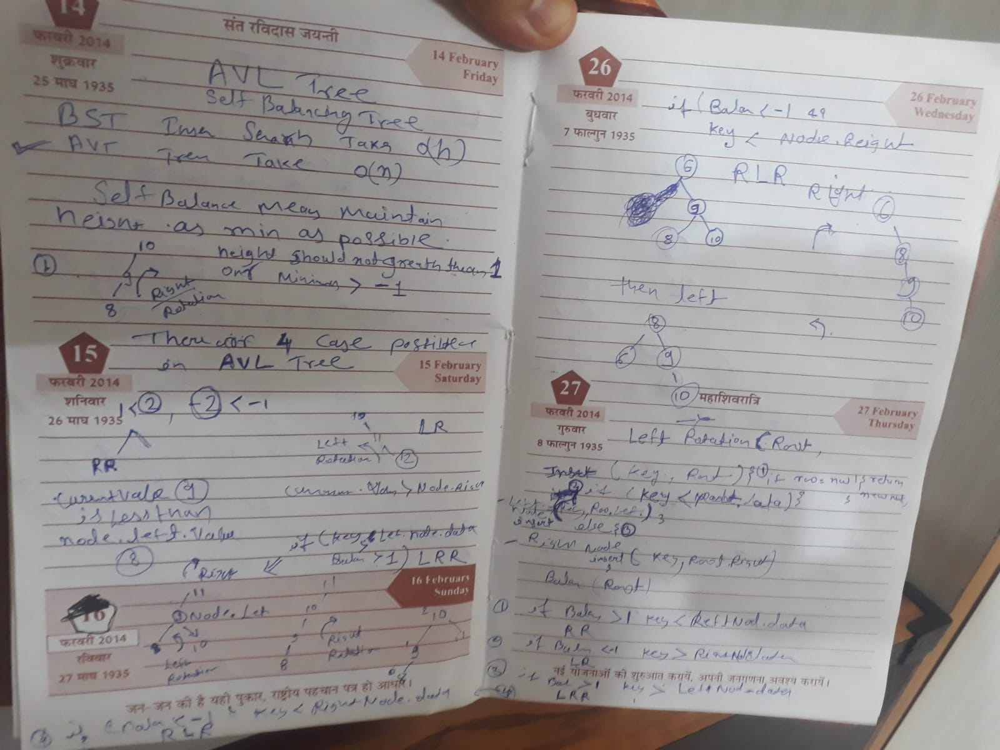
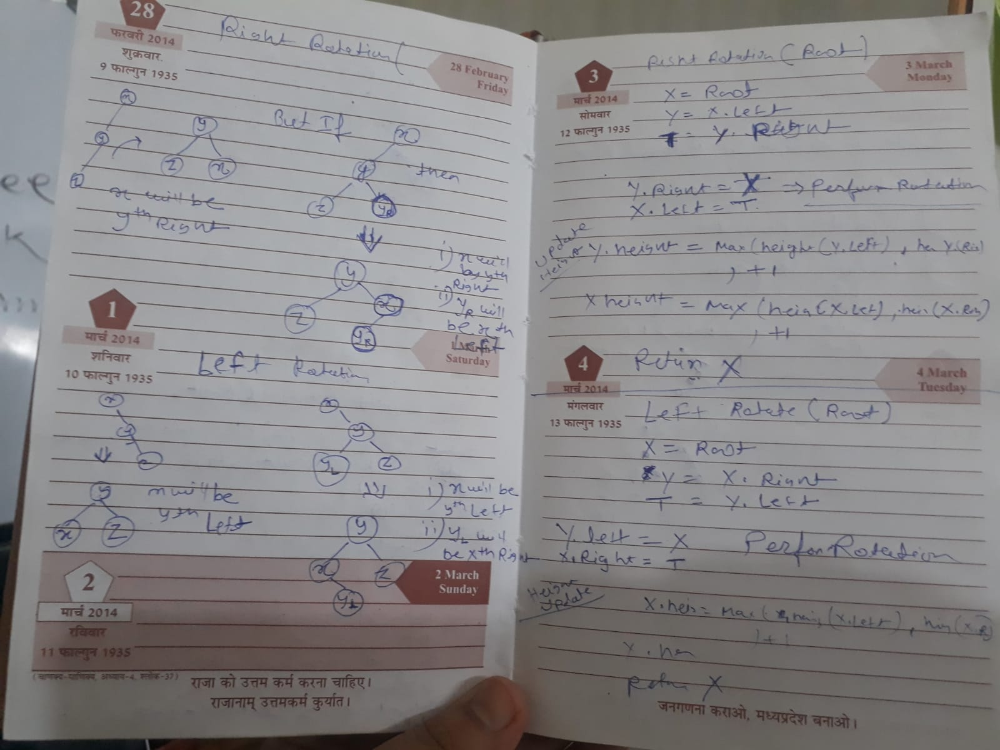

# AVL Tree :- 
https://www.youtube.com/watch?v=bBIhFbvavLk

### Insert an element :-
https://www.geeksforgeeks.org/avl-tree-set-1-insertion/
1. insert 
2. find balance 
3. rotation perform according to balance 
    if (balance>1 && key < root.left.data){
        perform Right Rotation
    }
    if (balance>1 && key > root.left.data){
        perform  Left Right Rotation
    }
    if (balance< -1 && key > root.right.data){
        perform Left Rotation
    }
    if (balance< -1 && key < root.right.data){
        perform  Right Left Rotation
    }
4. update height 

insert(root,val){
    if root==null return new Node(val)
    if(root.data>val){
        root.left = insert(root.left,val)
    } else {
        root.right = insert(root.left,val)
    }
}
5. leftRotate 

### Delete a element in AVL Tree :- 

    https://github.com/trekhleb/javascript-algorithms/tree/master/src/data-structures/tree/avl-tree
    
    // STEP 1: PERFORM STANDARD BST DELETE  :- All the functions's Steps are very similar to BST only step 2 and 3 is new 

    // STEP 2: UPDATE HEIGHT OF THE CURRENT NODE 

    // STEP 3: ROTATION:- GET THE BALANCE FACTOR OF THIS NODE (to check whether  this node became unbalanced)

        // Left Left Case  
        if (balance > 1 && this.getBalance(root.left) >= 0)  
            return this.rightRotate(root);  
  
        // Left Right Case  
        if (balance > 1 && this.getBalance(root.left) < 0)  
        {  
            root.left = this.leftRotate(root.left);  
            return this.rightRotate(root);  
        }  
  
        // Right Right Case  
        if (balance < -1 && this.getBalance(root.right) <= 0)  
            return this.leftRotate(root);  
  
        // Right Left Case  

https://adrianmejia.com/self-balanced-binary-search-trees-with-avl-tree-data-structure-for-beginners/

https://www.hackerearth.com/practice/data-structures/stacks/basics-of-stacks/practice-problems/algorithm/nearest-smaller-element-929558b4/