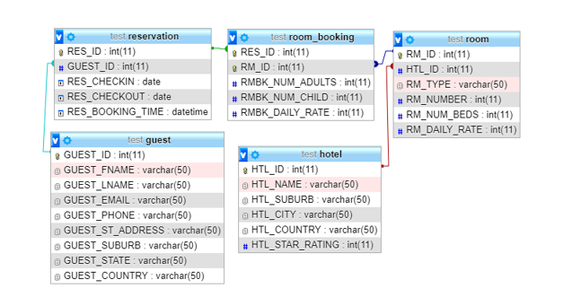

### MYSQL Study 
Mysql Study start

1. W3school is the best for learning and practice Mysql Queries 

    MySQL HAVING Clause (w3schools.com)

2. Tutorial point also good for learning Mysql 

    MySQL - Transactions (tutorialspoint.com)

Mysql query online test and learning  
MySQL online - Test SQL queries (extendsclass.com) 

3. What is Master Slave 
The Master-Slave Database Concept For Beginners - DEV Community 👩‍💻👨‍💻
https://dev.to/agustinustheo/the-master-slave-database-concept-for-beginners-5bfo

What is Master/Slave? - Definition from Techopedia
https://www.techopedia.com/definition/2235/masterslave

4. In MySQL what is the difference between != NULL and IS NOT NULL? (tutorialspoint.com)
https://www.tutorialspoint.com/in-mysql-what-is-the-difference-between-null-and-is-not-null

### Interview question 
https://www.fullstack.cafe/blog/mysql-interview-questions

### Find the country whose customers count is more than 5 BW ?
1. having 
2. GroupBy 

select count(Country),country from Customers group by Country having count(Country) > 1 order by Country ASC

Select count(Country) , Country from Customers 
group by Country 
having count(Country) > 5
order by Country DESC 

SELECT count(Country) as maxCount FROM Customers group by Country having maxCount > 5 order by maxCount desc limit 0,1;

### Find the Difference BW ?

https://www.youtube.com/watch?v=RZc4QSRRk98&ab_channel=CrackConcepts
https://www.youtube.com/watch?v=s1QkS4PfiFg&ab_channel=CrackConcepts

1. Difference between JOIN/UNION
2. Difference between WHERE/HAVING
3. Difference between UNION/UNION All 
4. Difference between GROUP BY/ORDER BY
5. Difference between JOIN/SUBQUERY
6. Difference between IN/EXISTS

### Find the Second Largest Salary in mysql ?
https://www.geeksforgeeks.org/sql-query-to-find-second-largest-salary/
1. If AS Working
SELECT name, MAX(salary) AS salary 
FROM employee 
WHERE salary <> (SELECT MAX(salary) 
FROM employee);
2.  If AS NOT Working
SELECT  MAX(Price)  FROM Products WHERE Price < (SELECT MAX(Price) FROM Products);

### How to find the third largest salary? 
Simple, we can do one more nesting.  

SELECT name, MAX(salary) AS salary
  FROM employee
 WHERE salary < (SELECT MAX(salary) 
                 FROM employee
                 WHERE salary < (SELECT MAX(salary)
                 FROM employee)
                ); 

### Find the Second Max Count in mysql ?
SELECT MAX(Price) as maximum FROM Products 
having maximum > MAX(Price)
group by Price 
order by Price desc  
limit 1,1;

#### Most efficient way to search test from multiple column in SQL?
1. https://stackoverflow.com/questions/9589813/most-efficient-way-to-search-in-sql

Solution :-  Add FULLTEXT INDEX AT (TITLE,DESCRIPTION)

#### Most efficient way to Fast Hotel Room Searching in SQL?

2. https://dba.stackexchange.com/questions/258191/mysql-query-of-hotel-database

